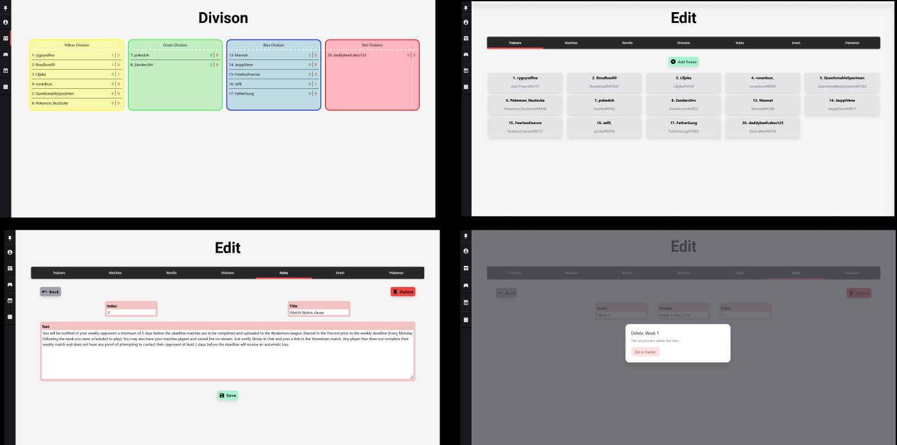

# Pokemon-League

This Project was designed to help Participants in Skrelps's Pokemon League to navigate and find information easily.

## Techologies

The foundation of this Website is built on the following technologies:

- **[Next.js](https://nextjs.org/):** A framework for building full-stack applications with React.
- **[Prisma](https://www.prisma.io/):** An ORM for Node.js, which simplifies access to the database.
- **[TypeScript](https://www.typescriptlang.org/):** A superset of the JavaScript programming language, which adds types and improves the overall developer experience.
- **[PostgreSQL](https://www.postgresql.org/):** A powerful, open source object-relational database. Hosted on Railway.app.

The following libraries are used to implement various features:

- **[Tailwind](https://tailwindcss.com):** A versatile CSS framework that makes building even the most complex layouts a breeze.
- **[React Hook Form](https://react-hook-form.com/)**: Manages all forms to avoid unnecessary re-renders.

